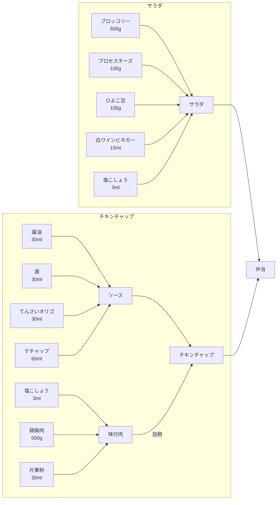

# r7kamura/cooking

Cooking recipe memo.

## Example

```mermaid
flowchart LR;

subgraph A [チキンチャップ]
  醤油\n30ml --> ソース
  酒\n30ml --> ソース
  てんさいオリゴ\n30ml --> ソース
  ケチャップ\n60ml --> ソース
  ソース --> チキンチャップ
  塩こしょうA --> 味付肉
  塩こしょうA[塩こしょう\n3ml]
  鶏胸肉\n500g --> 味付肉
  片栗粉\n30ml --> 味付肉
  味付肉 -- 加熱 --> チキンチャップ
end

subgraph B [サラダ]
  ブロッコリー\n500g --> サラダ
  プロセスチーズ\n100g --> サラダ
  ひよこ豆\n100g --> サラダ
  白ワインビネガー\n15ml --> サラダ
  塩こしょうB[塩こしょう\n3ml]
  塩こしょうB --> サラダ
end

サラダ --> 弁当
チキンチャップ --> 弁当
```

