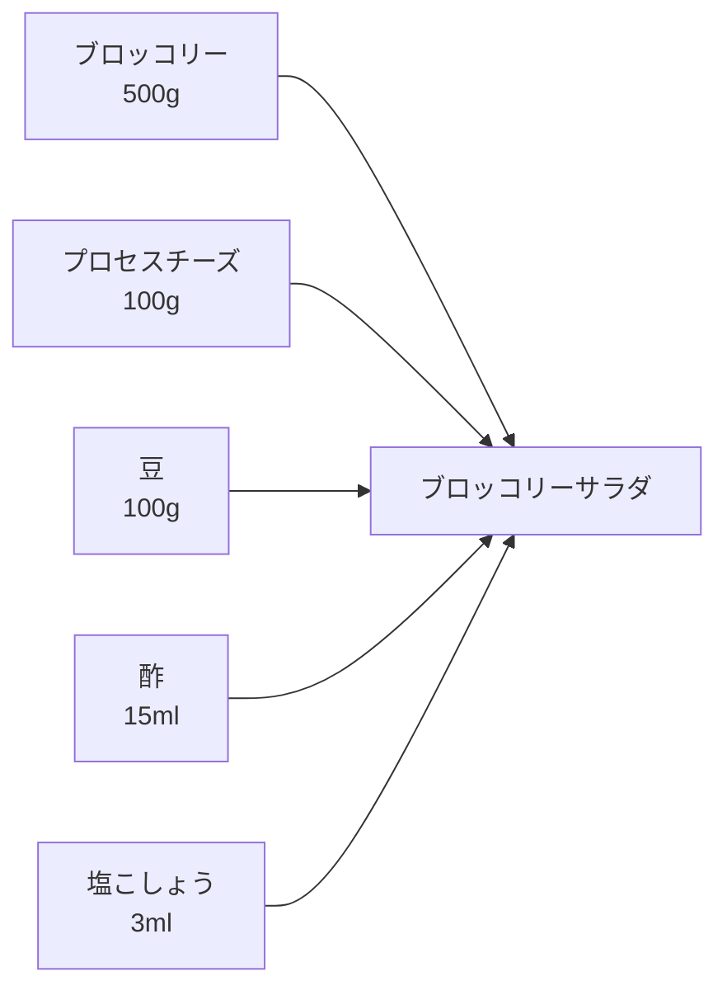

# ブロッコリーサラダ

混ぜるだけ。5食分。

```mermaid
flowchart LR;

ブロッコリー\n500g --> ブロッコリーサラダ
プロセスチーズ\n100g --> ブロッコリーサラダ
豆\n100g --> ブロッコリーサラダ
酢\n15ml --> ブロッコリーサラダ
塩こしょうB[塩こしょう\n3ml]
塩こしょうB --> ブロッコリーサラダ
```

## 食材メモ

### 酢

適当な酢でOK。白ワインビネガーが合いがち。

### 豆

水煮の豆であれば何でも。ミックスビーンズが楽。ひよこ豆が安牌。

### ブロッコリー

冷凍のやつが楽。
