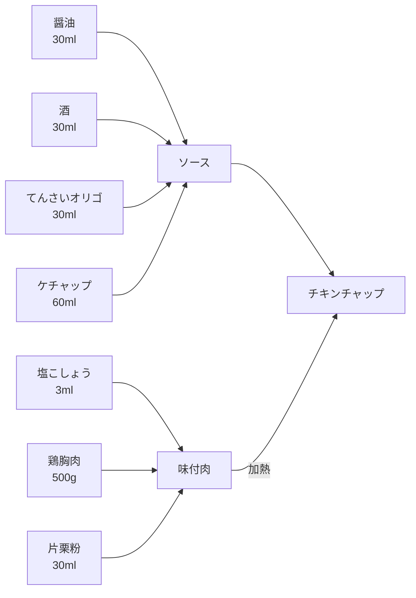

# チキンチャップ

炒めた鶏肉にソースを和える。

```mermaid
flowchart LR;

醤油\n30ml --> ソース
酒\n30ml --> ソース
てんさいオリゴ\n30ml --> ソース
ケチャップ\n60ml --> ソース
ソース --> チキンチャップ
塩こしょうA --> 味付肉
塩こしょうA[塩こしょう\n3ml]
鶏胸肉\n500g --> 味付肉
片栗粉\n30ml --> 味付肉
味付肉 -- 加熱 --> チキンチャップ
```

## 食材メモ

### てんさいオリゴ

蜂蜜や砂糖でも可。てんさいオリゴはヘルシーな択。

### 鶏胸肉

鶏もも肉でも可。もも肉はこってり、胸肉はさっぱり気味。

## 作成例

