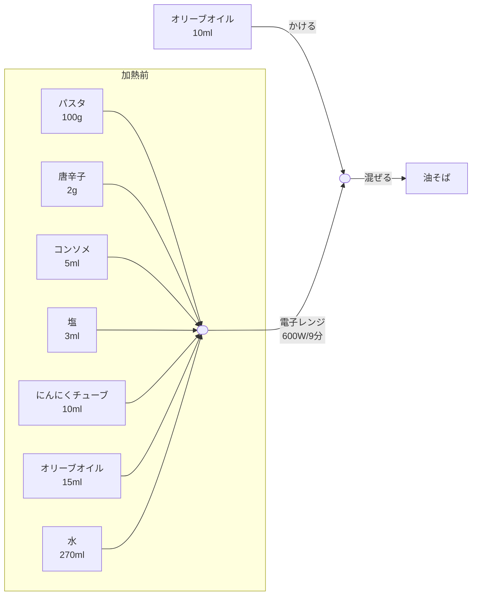

# 油そば

レンジでつくるペペロンチーノ。

```mermaid
flowchart LR;

オリーブオイル\n10ml -- かける --> a

subgraph A [加熱前]
パスタ\n100g --> b
唐辛子\n2g --> b
コンソメ\n5ml --> b
塩\n3ml --> b
にんにくチューブ\n10ml --> b
オリーブオイル\n15ml --> b
水\n270ml --> b
end

b -- 電子レンジ\n600W/9分 --> a

a([ ])

b([ ])

a -- 混ぜる --> 油そば
```
