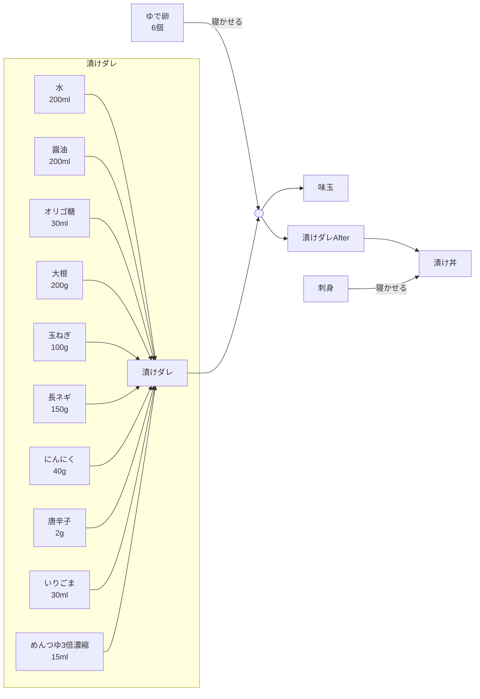

# 味玉・漬け丼

漬けタレは漬け丼に再利用できる。

```mermaid
flowchart LR;

ゆで卵\n6個 -- 寝かせる --> a

subgraph A [漬けダレ]
水\n200ml --> 漬けダレ
醤油\n200ml --> 漬けダレ
オリゴ糖\n30ml --> 漬けダレ
大根\n200g --> 漬けダレ
玉ねぎ\n100g --> 漬けダレ
長ネギ\n150g --> 漬けダレ
にんにく\n40g --> 漬けダレ
唐辛子\n2g --> 漬けダレ
いりごま\n30ml --> 漬けダレ
めんつゆ3倍濃縮\n15ml --> 漬けダレ
end

漬けダレ --> a

a([ ])

a --> 味玉
a --> 漬けダレAfter

漬けダレAfter --> 漬け丼
刺身 -- 寝かせる --> 漬け丼
```
